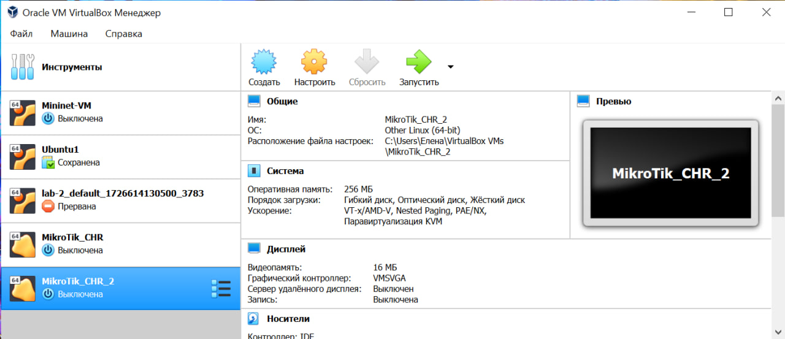

University: [ITMO University](https://itmo.ru/ru/)  
Faculty: [FICT](https://fict.itmo.ru)  
Course: [Network programming](https://github.com/itmo-ict-faculty/network-programming)  
Year: 2024/2025  
Group: K34212  
Author: Elena Darovskikh  
Lab: Lab2  
Date of create: 26.12.2024  
Date of finished: 27.12.2024

## Лабораторная работа №2 "Развертывание дополнительного CHR, первый сценарий Ansible"

## <a name="section1">Описание</a>
В данной лабораторной работе вы на практике ознакомитесь с системой управления конфигурацией Ansible, использующаяся для автоматизации настройки и развертывания программного обеспечения.

## <a name="section2">Цель работы</a>
С помощью Ansible настроить несколько сетевых устройств и собрать информацию о них. Правильно собрать файл Inventory.

## <a name="section4">Ход работы</a>

Был установлен второй CHR.

