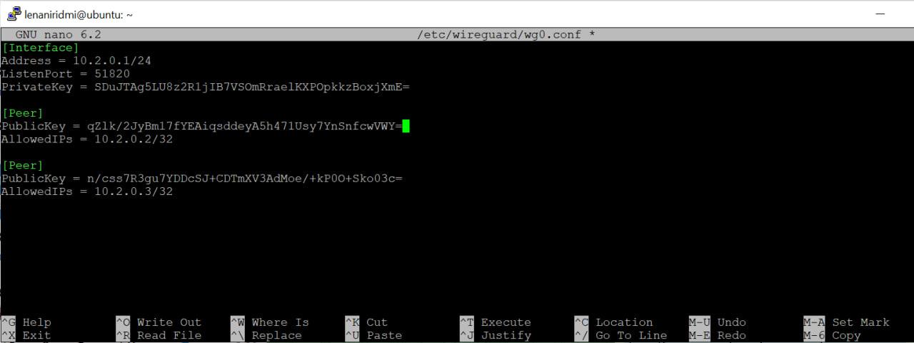
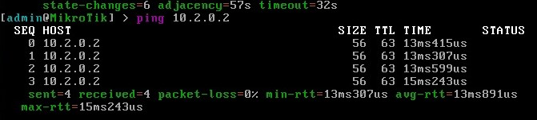
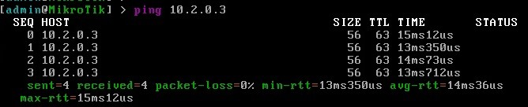
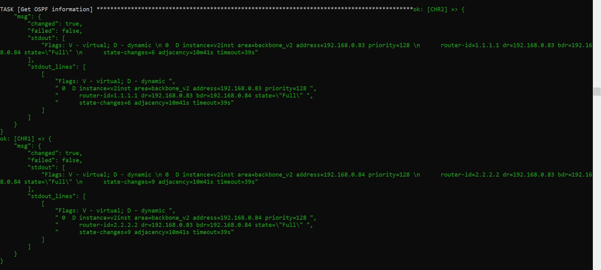
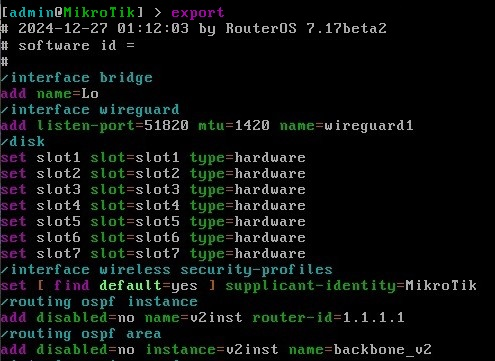
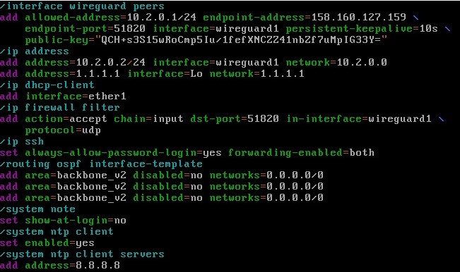
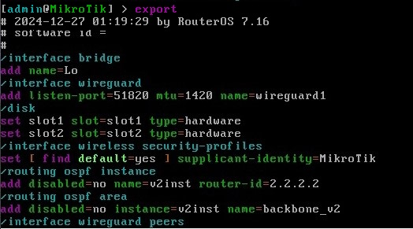
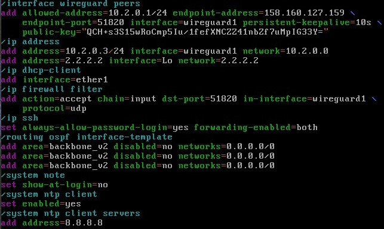

University: [ITMO University](https://itmo.ru/ru/)  
Faculty: [FICT](https://fict.itmo.ru)  
Course: [Network programming](https://github.com/itmo-ict-faculty/network-programming)  
Year: 2024/2025  
Group: K34212  
Author: Elena Darovskikh  
Lab: Lab2  
Date of create: 26.12.2024  
Date of finished: 27.12.2024

## Лабораторная работа №2 "Развертывание дополнительного CHR, первый сценарий Ansible"

## <a name="section1">Описание</a>
В данной лабораторной работе вы на практике ознакомитесь с системой управления конфигурацией Ansible, использующаяся для автоматизации настройки и развертывания программного обеспечения.

## <a name="section2">Цель работы</a>
С помощью Ansible настроить несколько сетевых устройств и собрать информацию о них. Правильно собрать файл Inventory.

## <a name="section4">Ход работы</a>

Был установлен второй CHR.


Была произведена настройка пользоватля admin и клиента WireGuard для поднятия  VPN соединения. Была сгенерирована вторая пара ключей при помощи следующей команды:

```
wg genkey | sudo tee /etc/wireguard/wg0-client2-private.key | wg pubkey | sudo tee /etc/wireguard/wg0-client2-public.key
```

На сервере в конфигурационный файл /etc/wireguard/wg0.conf был добавлен второй пир:



На CHR2 был добавлен интерфейс wireguard1 и назначен его ip-адрес, настроен пир и добавлено правило в firewall (разрешен трафик WireGuard).

```
/interface wireguard add listen-port=51820 mtu=1420 name=wireguard1
/interface wireguard peers add allowed-address=10.2.0.1/24 endpoint-address=158.160.53.43
endpoint-port=51820 interface=wireguard1 persistent-keepalive=10s
public-key="публичный ключ сервера"
/ip address add address=10.2.0.3/24 interface=wireguard1 network=10.2.0.0
/ip firewall filter add action=accept chain=input dst-port=51820 int-interface=wireguard1
protocol=udp
```
Дальше была проведена проверка связности:





Далее была произведена настройка виртуальных машин с Ansible.
При помощи Ansible одновременно на двух CHR были настроены:
 - логин/пароль
 - NTP Client
 - OSPF с указанием Router ID

Была собран файл Inventory:

```
[CHRs]
CHR1 ansible_host=10.2.0.2 router_id=1.1.1.1
CHR2 ansible_host=10.2.0.3 router_id=2.2.2.2

[CHRs:vars]
ansible_user=admin
ansible_password=admin
ansible_connection=network_cli
ansible_network_os=routeros
```
Тут перечисляются устройства, на которых будет производиться настройка (CHR1 и CHR2). А также прописываются переменные, которые при настройке будет подтягивать playbook.

Плейбук:

```
---

- name: "playbook for lab2" 
- hosts: CHR1, CHR2
  vars:
    host_vars:
      CHR1:
        router_ip: 1.1.1.1
      CHR2:
        router_ip: 2.2.2.2

  tasks:
    - name: Set User&Password
      community.routeros.command:
        commands: "user add name=user password=user group=full"
    
    - name: Set NTP
      community.routeros.command:
        commands: "system ntp client set enabled=yes primary-ntp=8.8.8.8"

    - name: Set OSPF
      community.routeros.command:
        comands: 
          - /interface bridge add name=Lo
          - /ip address add interface=Lo address="{{ router_id }}/32" 
          - /routing ospf instance set router-id="{{ router_id }}"
          - /routing ospf  network=0.0.0.0/0 add area=backbone" 

    - name: Collect config
      community.network.routeros.facts:
        gather_subset:
          - config
          - ansible_net_ospf_instance 
          - ansible_net_ospf_neighbor
         
...
ansible_net_ospf_instance 
ansible_net_ospf_neighbor
```
Данный файл содержит в себе сценарии действий настройки. Здесь указано, на каких устройствах будет производиться настройка и перечислены задания, содержащие команды настройки.

После завершения настройки устройств были собранны данные по OSPF топологии и полные конфиги устройств. За это отвечают последние task-ов в playbook.

Собранные данные по OSPF:



Конфиги после настройки устройств:

- CHR1:




- CHR2:
  



**Вывод**

В данной лабораторной работе была создана вторая виртуальная машина CHR2, с помощью Ansible на CHR1 и CHR2 были настроены логин/пароль, NTP Client, OSPF. Были собраны конфигурационные данный по машинах и данные по OSPF.
