University: [ITMO University](https://itmo.ru/ru/)  
Faculty: [FICT](https://fict.itmo.ru)  
Course: [Network programming](https://github.com/itmo-ict-faculty/network-programming)  
Year: 2024/2025  
Group: K34212  
Author: Elena Darovskikh  
Lab: Lab3  
Date of create: 26.12.2024  
Date of finished: 27.12.2024

## Лабораторная работа №3 "Развертывание Netbox, сеть связи как источник правды в системе технического учета Netbox"

## <a name="section1">Описание</a>
В данной лабораторной работе вы ознакомитесь с интеграцией Ansible и Netbox и изучите методы сбора информации с помощью данной интеграции.

## <a name="section2">Цель работы</a>
С помощью Ansible и Netbox собрать всю возможную информацию об устройствах и сохранить их в отдельном файле.

## <a name="section4">Ход работы</a>

**Поднятие NetBox**
  
На ВМ в YandexCloud был поднят NetBox. Для этого последовательно были настроены база данных PostrgreSQL, Redis, NetBox, Gunicorn и HTTP сервер nginx.

Были установлены пакеты postrgresql.

```
sudo apt update
sudo apt install -y postgresql
```

Была создана база данных и настроен пользователь для допуска к ней.

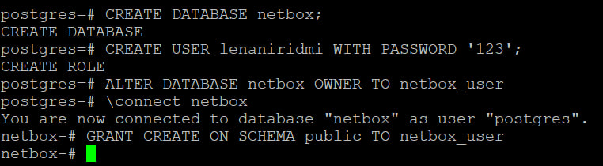
  
Был проверен статус системы:

```
psql --username netbox --password --host localhost netbox
```

**Настройка хранилища данных Redis**
  
NetBox использует Redis для кеширования и орагнизации очередей. Были установлены пакеты.

```
sudo apt install -y redis-server
```

Был проверен статус службы с помощью команды:

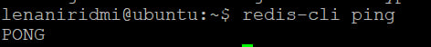

**Установка необходимых пакетов для NetBox**
  
Перед установкой самого NetBox были установлены все необходимые системные пакеты Python.

```
sudo apt install -y python3 python3-pip python3-venv python3-dev build-essential libxml2-dev libxslt1-dev libffi-dev libpq-dev libssl-dev zlib1g-dev
```

Была создана директория, куда была скллонирована ветка из репозитория NetBox.

```
sudo mkdir -p /opt/netbox/
cd /opt/netbox/
sudo git clone -b master --depth 1 https://github.com/netbox-community/netbox.git .
```

Был создан системный пользователь netbox  и настроены его права.

```
sudo adduser --system --group netbox
sudo chown --recursive netbox /opt/netbox/netbox/media/
sudo chown --recursive netbox /opt/netbox/netbox/reports/
sudo chown --recursive netbox /opt/netbox/netbox/scripts/
 ```
  
Был создан конфигурационный файл - копия cnfiguratiom_example.py для хранения локальных параметров конфигурации.

```
cd /opt/netbox/netbox/netbox/
sudo cp configuration_example.py configuration.py
```
В этом файле были прописаны список хостов(ALLOWED_HOSTS), параметры базы данных(имя пользователя, пароль и т.д.), параметры Redis, случайно сгенерированный ключ(SECRET_KEY).

Код для генерирования ключа

```
python3 ../generate_secret_key.py
```

Файл имел вид:

  ```
  ALLOWED_HOSTS = ['*']
  DATABASE = {
     'NAME': 'netbox',               # Database name
     'USER': 'netbox',               # PostgreSQL username
     'PASSWORD': 'пароль',           # PostgreSQL password
     'HOST': 'localhost',            # Database server
     'PORT': '',                     # Database port (leave blank for default)
     'CONN_MAX_AGE': 300,            # Max database connection age (seconds)
  }

  SECRET_KEY = 'YAuPn3kHU$#0kyQ-*9_CgXg4VxRKdSkekHL7M&v7&j+(wj-^Fe'
  ```
  
Был заупщен скрипт для создания виртуальной среды Python, установки всех необходимых пакетов Python, запуска миграции схемы базы данных:

```
sudo /opt/netbox/upgrade.sh
```
  
После этого был создан супер пользователь - администратор для досупа к NetBox. Была активирована вирутальная среда Python.

```
source /opt/netbox/venv/bin/activate
cd /opt/netbox/netbox
python3 manage.py createsuperuser
```

**Настройка Gunicorn**
  
NetBox работает как WSGI-приложение за HTTP-сервером, поэтому было необходимо настроить Gunicorn. 

Был скопирован конфигурационный файл, в котором уже были необходимые настройки, и другие необходимые файлы. После этого был перезапущен демон systemd

```
sudo cp /opt/netbox/contrib/gunicorn.py /opt/netbox/gunicorn.py
sudo cp -v /opt/netbox/contrib/*.service /etc/systemd/system/
sudo systemctl daemon-reload
```

Были запущены сервисы netbox и netbox-rq и включен их запуск во время загрузки. После запуска был проверен их статус:

```
sudo systemctl start netbox netbox-rq
sudo systemctl enable netbox netbox-rq
```

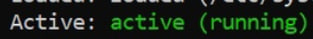

**Настройка HTTP сервера**
  
Был выбран nginx. Были произведены его установка и копирование конфигурационного файла, созданного NetBox.

```
sudo apt install -y nginx
sudo cp /opt/netbox/contrib/nginx.conf /etc/nginx/sites-available/netbox
```

Был заменен созданный по умолчанию nginx конфигурационный файл на файл, созданный выше:

```
sudo rm /etc/nginx/sites-enabled/default
sudo ln -s /etc/nginx/sites-available/netbox /etc/nginx/sites-enabled/netbox
```

После этого сервис был перезапущен
  
```
sudo systemctl restart nginx
```

Приложение NetBox стало доступно как веб-приложение по ip-адресу виртуальной машины: https://158.160.48.189

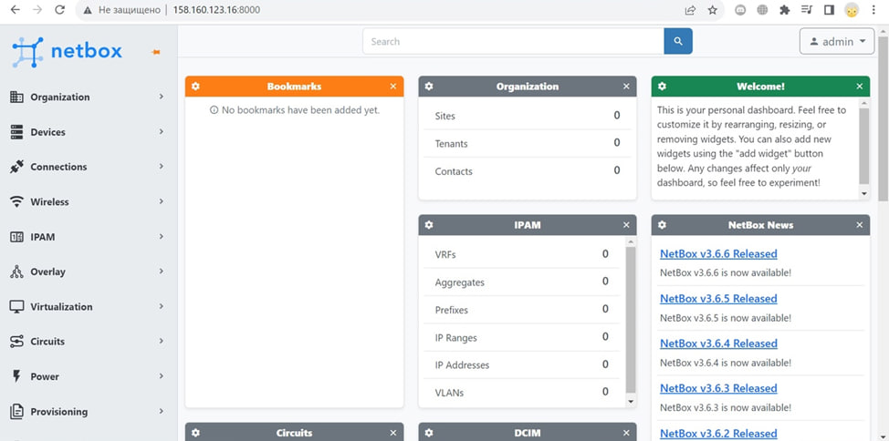

**Заполнение информации об устройствах в NetBox**

В NetBox были добавлены устройства - CHR1 и CHR2, а в них - данные об интерфесах и IP-адреса. Так же были добавлены такие записи как, Site(NetProgLabs - физическое расположение устройств), роль (роутер), производитель (MikroTik)и тип (RouterOsv7), которые указывались в описании устройств.

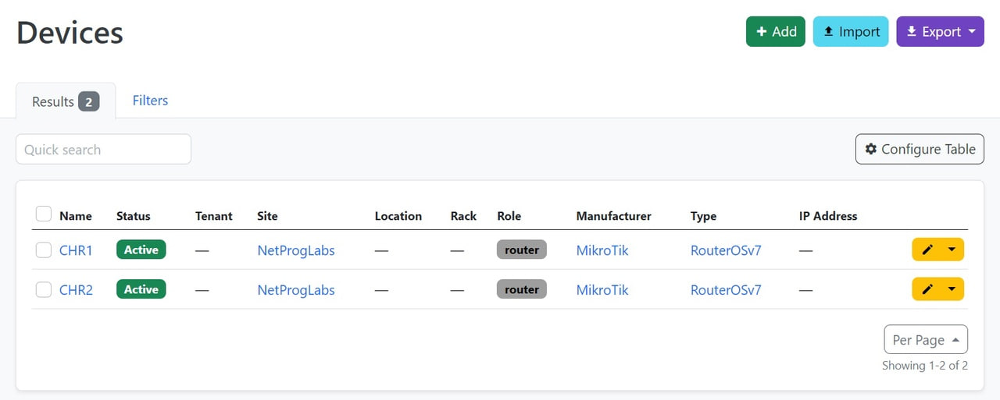

**Сохранение данных из NetBox в отдельный файл**

Для сбора информации из NetBox был использован модуль netbox.netbox.nb_inventory в Ansible. Для этого был создан файл netbox_inventory.yml с следующим содержанием:

```
---
plugin: netbox.netbox.nb_inventory
api_endpoint: https://158.160.48.189
token: токен
validate_certs: False
config_context: False
group_by:
- device_roles
interfaces: 'True'
```

В нём используется API токен, созданый в приложении NetBox.

Информация об устройствах была сохранена в inventory файл.

```
ansible-inventory -v --list -i netbox_inventory.yml > nb_inventory.yml
```

**Настройка двух CHR по сценарию**
  
Для изменения имени устройств и добавления IP-адресов был написан сценарий: 

```
  - name: Routers Configuration
    hosts: device_roles_router
    tasks:
      - name: Set Devices Name
        community.routeros.command:
          commands:
            - /system identity set name="{{interfaces[0].device.name}}"
      - name: Set additional IP
        community.routeros.command:
          commands:
          - /interface bridge add name="{{interfaces[1].display}}"
          - /ip address add address="{{interfaces[1].ip_addresses[0].address}}" interface="{{interfaces[1].display}}"
```
  После его выполнения был получен следующий результат

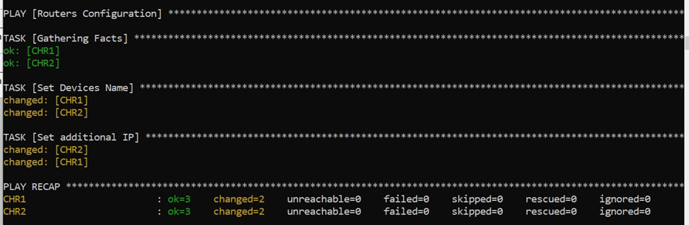
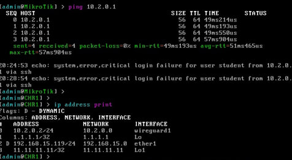
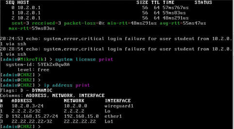

**Написание сценария для сбора серийного номера устройства и его вноса в NetBox**
   
Был написан следующий сценарий:

  ```
  - name: Get Serial Numbers To NetBox
  hosts: device_roles_router
  tasks:
    - name: Get Serial Number
      community.routeros.command:
        commands:
          - /system license print
      register: license_print
    - name: Get Name
      community.routeros.command:
        commands:
          - /system identity print
      register: identity_print
    - name: Add Serial Number to Netbox
      netbox_device:
        netbox_url: https://158.160.48.189
        netbox_token: токен
        data:
          name: "{{identity_print.stdout_lines[0][0].split(' ').1}}"
          serial: "{{license_print.stdout_lines[0][0].split(' ').1}}"
        state: present
        validate_certs: False
  ```

После его выполнения был получен следующий результат:

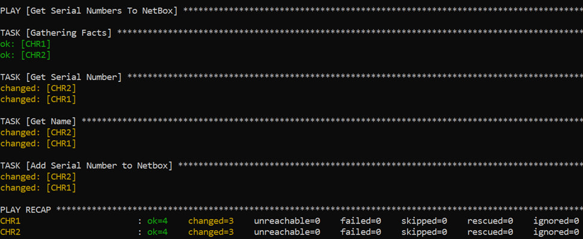
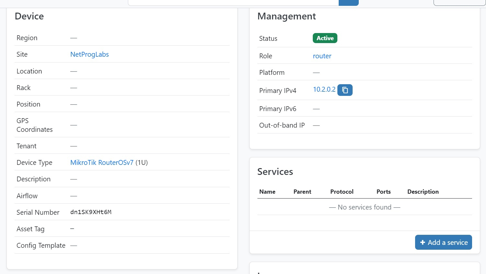
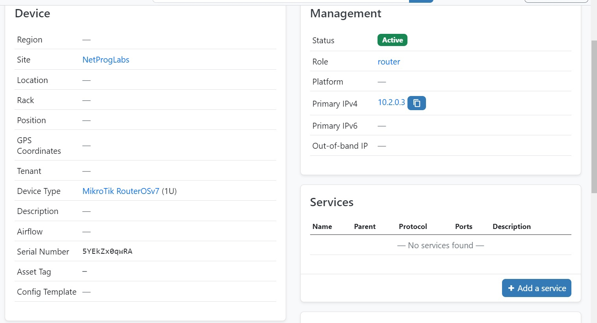

**Вывод**

С помощью Ansible и Netbox была собрана вся возможная информация об устройствах CHR1 и CHR2 и сохранена в отдельном файле nb_inventory.yml, был создан сценарий для смены имен устройств и добавления IP. Также были собраны серийные номера устройств и внесены в NetBox.
